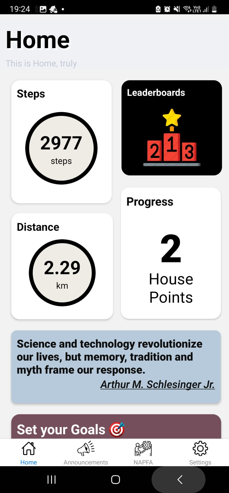
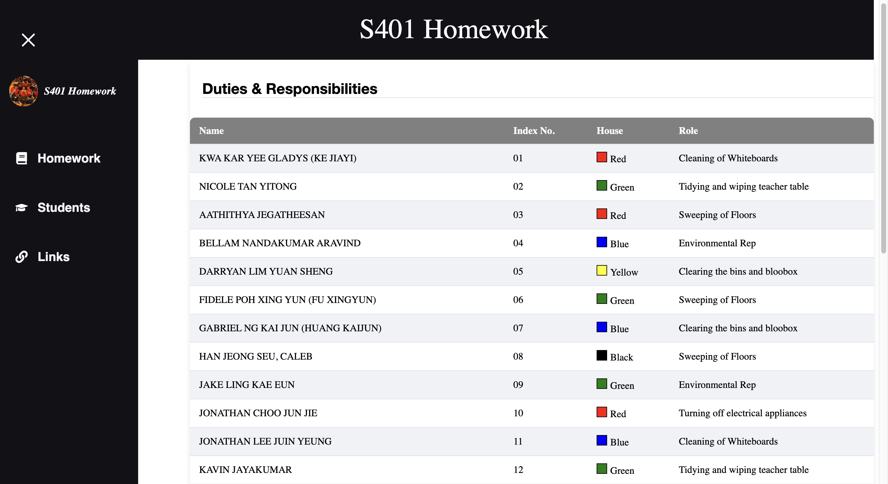
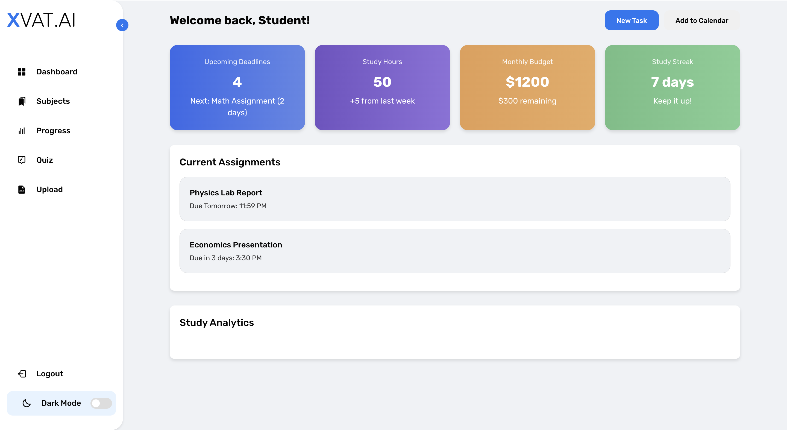
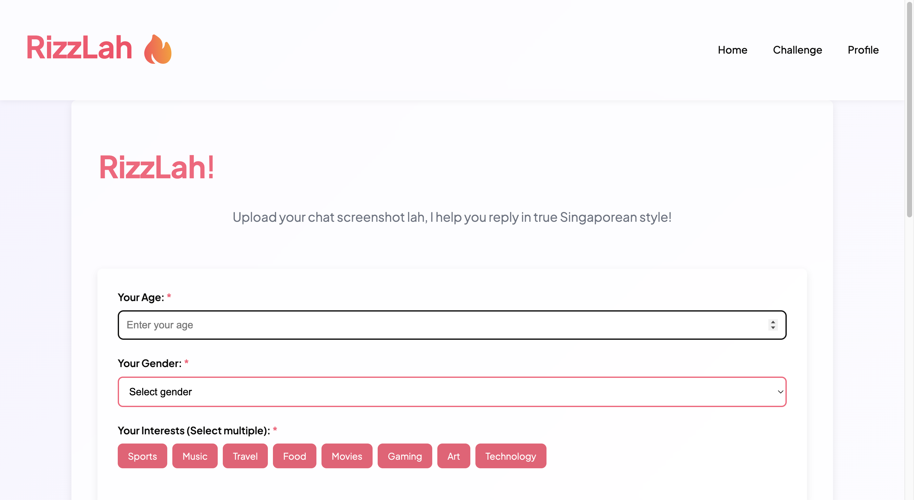

<h1 align="left">Hello! My name is Aravind 👋</h1>

I am a student based in Singapore with a strong passion for coding, web design, and front-end development. I am also an avid football player and enjoy exploring innovative ideas in technology and design.

---

<h2 align="left">Languages and Tools</h2>

  
  
  
  
  
  
  
  
  
  
  
  

---

<h2 align="left">Connect with Me</h2>

  
  
  

---

<h2 align="left">About Me</h2>

<h3 align="left">I am a competent individual who values teamwork and strives to build positive relationships with peers. My passions include:</h3>
<ul>
  <li>Front-end development</li>
  <li>Football and staying active</li>
  <li>Designing engaging websites</li>
  <li>Building mobile applications</li>
</ul>

---

### Table of Contents

1. [GrowCalth](#growcalth)
2. [S401 Homework Management Platform](#s401-homework-management-platform)
3. [Comp Coursework](#comp-coursework)
4. [XVAT.AI](#xvatai)
5. [Rizzlah](#rizzlah)

---

### Projects

#### 1. GrowCalth
**Description:**  
An one stop platform for student to actively contribute to their house every year by taking steps. For every 10,000 steps a house registers in our app, they will be rewarded with 1 point.

## Features
- Leaderboard of House Standings
- View Napfa records of each year starting from 2023.
- Notify students on house matters with the help of house representatitves.
- User-friendly and responsive design

**Screenshot:**  

**GitHub Repository:**  
[GrowCalth](https://github.com/kidscoots101/GrowCalth-Final.git)

---

#### 2. S401 Homework Management Platform
**Description:**  
A comprehensive platform designed for students to take note of the amount of homework they have and their respective deadlines. 

## Features
- List of Student's Duties and Responsibilities within the classroom to make them accountable.
- Links of various Documents, Slides and Sheets which students use daily.

**Screenshot:**  

**GitHub Repository:**  
[S401 Homework Management Platform](./screenshots/s401-homework.png)

---

#### 3. Comp Coursework
**Description:**  
A platform that allows students and teachers to place their food orders through their device before their recess breaks with card payments.

## Features
- Verification Checks of Students and Teachers
- User-friendly and responsive design

**GitHub Repository:**  
[Comp Coursework](https://github.com/TheshyanTTT/Comp-Coursework.git)

---

#### 4. XVAT.AI
**Description:**  
A personal assistant website that helps students study by asking questions, and offering hints or explanations.

## Features
- Interactive Question Quiz
- Progress Tracker
- Hints and Explanations
- User-Friendly Interface
- Feedback and Adaptation

**Screenshot:**  

**GitHub Repository:**  
[XVAT.AI](https://github.com/kidscoots101/pdf.git)

---

#### 5. Rizzlah
**Description:**  
An innovative platfrom that allows users to muster the courage to speak up to his partner by using pick-up lines or other methods with the help of Artificial Intelligence.  

## Features
- Artifical Intelligence that responds in Singlish.
- User-friendly and responsive design
- Challenge Page: Users can challenge against one another (WIP)
- Rizz Score: Calculate your ability to charm someone

**Screenshot:**  

**GitHub Repository:**  
[Rizzlah](https://github.com/Aravind-BN/rizzlah.git)
